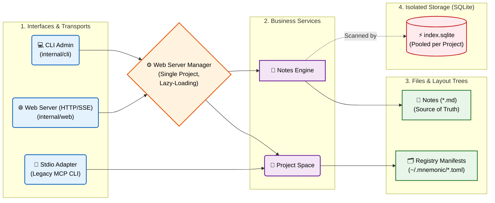
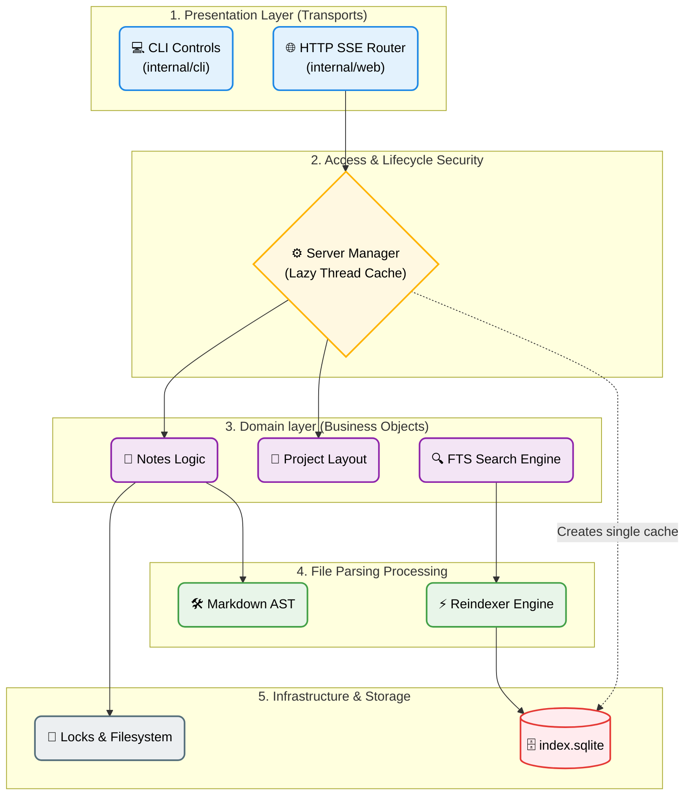

# mnemonic

mnemonic is a local-first knowledge base, search tool, and MCP server for Markdown notes.

It provides:

- a CLI for project, note, and web serving management,
- a file-based registry for central and local project spaces,
- a disposable per-project SQLite index for search/backlinks/tags,
- an **HTTP Web MCP Server** utilizing the **Server-Sent Events (SSE)** transport.

## Principles

- Markdown files are the source of truth.
- The project registry is simple and fully file-based (no database).
- Index databases are disposable and can be rebuilt at any time.
- Web routing state is deterministic: the selected project is validated on boot and connections are pooled efficiently.
- Human-readable output is friendly; `--json` is automation-friendly.

## Feature Highlights

- Lightweight file-based registry with slug/UUID addressing.
- Full-text search using SQLite FTS5 and automatic backlinks generation.
- Multi-tenant HTTP SSE server engine with explicit user token isolation.
- Thread-safe, lazy-loading instance manager (`sync.RWMutex`) to minimize database connection footprints.
- Built-in administrative commands for web user provisioning and permission mapping.

## Installation

Build from source:

```bash
git clone https://github.com/ilyachch/mnemonic.git
cd mnemonic
go build ./cmd/mnemonic
```

Install binary into Go bin:

```bash
go install github.com/ilyachch/mnemonic/cmd/mnemonic@latest
```

## Quick Start

### 1. Local Workspace Configuration

Initialize a local project layout:

```bash
mnemonic init my-notes --local
```

Create a note:

```bash
mnemonic notes create --project my-notes --title "System Architecture" --tag design --tag ops
```

Build the initial index:

```bash
mnemonic project reindex my-notes
```

### 2. Web Server Setup

Start the HTTP Web MCP server for the selected project:

```bash
mnemonic web serve --project my-notes --port 8080
```

Your AI client can now establish an MCP session using the standard HTTP/SSE endpoints. The server is scoped to one resolved project and requires `MNEMONIC_PROJECT_TOKEN` when bearer auth is enabled:

- **SSE Connection:** `GET http://localhost:8080/sse`
- **Client Messages:** `POST http://localhost:8080/messages`

## Data Model and Paths

mnemonic strictly separates content, registry metadata, and ephemeral cache paths:

- **Config:** `$XDG_CONFIG_HOME/mnemonic/config.toml`
- **Registry & Projects (`memories_home`):** `~/.mnemonic/` (default)
- **Per-project Indexes:** `$XDG_STATE_HOME/mnemonic/projects/<PROJECT_ID>/index.sqlite`
- **Locks:** `$XDG_STATE_HOME/mnemonic/projects/<PROJECT_ID>/locks/`

## CLI Reference

Top-level command scopes:

- `completion`: generate shell completion scripts.
- `config`: inspect effective config.
- `init`: initialize a project.
- `mcp`: run legacy MCP stdio adapter.
- `notes`: note operations.
- `project`: project operations.
- `tags`: tag listing.
- `version`: print build version.
- `web`: HTTP MCP server controls.

### `web` command group

Administrative management for the HTTP Server-Sent Events architecture.

#### `web serve`

```bash
mnemonic web serve --project PROJECT [--port 8080]
```

Launches the HTTP web listener for one resolved project. The server uses the normal project selector order, exposes only `/sse` and `/messages`, and authenticates with `MNEMONIC_PROJECT_TOKEN` when configured.

### `project` commands

#### `project list`

```bash
mnemonic project list
```

Scans the registry home and displays active projects. If a project is corrupt or a local project's path is missing, it marks them appropriately:

- `[CORRUPTED]` (mismatched configurations)
- `[ORPHANED/MISSING]` (local workspace path moved or deleted)

#### `project reindex`

```bash
mnemonic project reindex [NAME_OR_UUID]
mnemonic project reindex --all
```

- with selector: rebuild one project index.
- with `--all`: rebuild all active projects.

### `notes` commands

#### `notes list`

```bash
mnemonic notes list --project PROJECT
```

#### `notes show`

```bash
mnemonic notes show SELECTOR --project PROJECT
```

Selector can be a note UUID, slug, path, or title.

#### `notes edit`

```bash
mnemonic notes edit SELECTOR --project PROJECT --if-match <content_hash> --append "text"
```

Enforces optimistic concurrency using custom SHA-256 hashes generated across note contents.

## Configuration

Typical config file location: `$XDG_CONFIG_HOME/mnemonic/config.toml`

```toml
version = 1

[paths]
memories_home = "~/.mnemonic"

[notes]
delete_behavior = "trash"
trash_dir_name = ".trash"

[index]
fts = true
wal = true
busy_timeout_ms = 5000

[output]
json_pretty = true

[logging]
level = "info"
```


## Development

### High-Level Architecture



### Detailed Architecture


