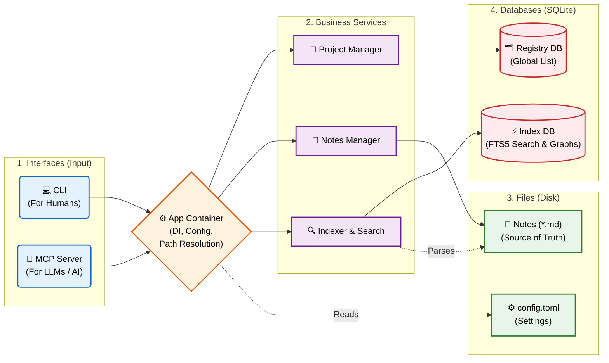
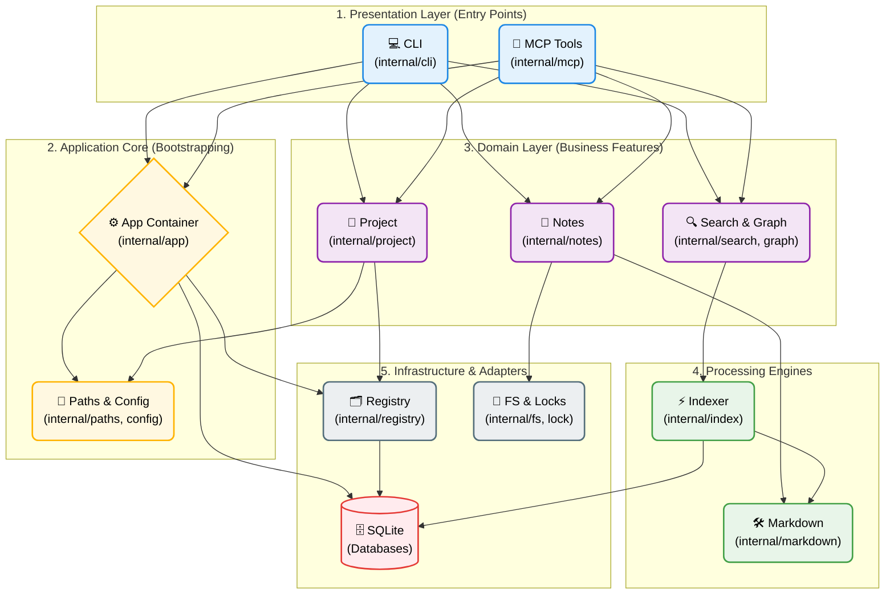

# mnemonic

mnemonic is a local-first knowledge base and search tool for Markdown notes.

It provides:
- a CLI for project and note lifecycle management,
- a disposable per-project SQLite index for search/backlinks/tags,
- an MCP stdio server for AI-tool integrations.

## Principles

- Markdown files are the source of truth.
- Index databases are disposable and can be rebuilt.
- Project operations are explicit and path-safe.
- Human-readable output is friendly; `--json` is automation-friendly.

## Feature Highlights

- Project registry with slug/UUID addressing.
- Multiple project layouts (`regular`, `local`, `detached`).
- Full-text search via SQLite FTS5.
- Backlinks graph from indexed notes.
- Safe note editing with conditional update (`--if-match`).
- App-agnostic MCP adapter over stdio.

## Installation

Build from source:

```bash
git clone https://github.com/ilyachch/mnemonic.git
cd mnemonic
go build ./cmd/mnemonic
```

Install binary into Go bin:

```bash
go install github.com/ilyachch/mnemonic/cmd/mnemonic@latest
```

## Quick Start

1. Initialize a project (local layout):

```bash
mnemonic init my-notes --local
```

2. Create a note:

```bash
mnemonic notes create --project my-notes --title "System Architecture" --tag design --tag ops
```

3. Build or refresh index:

```bash
mnemonic project reindex my-notes
```

4. Search notes:

```bash
mnemonic notes search "architecture" --project my-notes
```

5. Show note content:

```bash
mnemonic notes show system-architecture --project my-notes
```

## Data Model and Paths

mnemonic follows XDG directories:

- Config: `$XDG_CONFIG_HOME/mnemonic/`
- Registry DB: `$XDG_DATA_HOME/mnemonic/registry.sqlite`
- Per-project state/index: `$XDG_STATE_HOME/mnemonic/projects/<PROJECT_ID>/`

By design, note files live in project memories paths, while indexes/state live under XDG state.

## Project Types

`mnemonic init` creates one of three project types.

### regular

This is the default mode when you run `mnemonic init NAME` without extra flags.

- Creates a `.mnemonic` project marker in the current repository.
- Stores a `mnemonic.toml` manifest under the shared memories home.
- Uses the slug as the project memories path.
- Best fit for repository-centric knowledge bases where the Markdown lives outside the repo tree but is still owned by the project.

### local

Use `--local` when you want the project content to live directly inside the current repository.

- Creates a `.mnemonic` project marker in the current repository.
- Stores Markdown under `.mnemonic-memories/<slug>` inside the repo.
- Keeps project data self-contained for local development, demos, or lightweight personal vaults.
- This is the mode shown in most quick-start examples because it is easy to bootstrap and inspect.

### detached

Use `--detached` for a project that exists primarily as a shared memories directory and is not anchored by a local `.mnemonic` repository marker.

- Creates a `mnemonic.toml` manifest under the memories home.
- Does not create a repository-local `.mnemonic` file.
- Is useful when the project is shared or accessed from outside a single working tree.
- The project is still registered, so it can be discovered, shown, reindexed, and used through the CLI and MCP.

In short:

- default = `regular`
- `--local` = repo-local markdown storage
- `--detached` = memories-home-first project without a repo marker

## CLI Reference

Top-level commands:

- `completion`: generate shell completion scripts.
- `config`: inspect effective config.
- `init`: initialize a project.
- `mcp`: run MCP stdio adapter.
- `notes`: note operations.
- `project`: project operations.
- `tags`: tag listing.
- `version`: print build version.

All commands support `--json` global output mode.

### init

Create a project from the current working directory.

```bash
mnemonic init NAME [--local | --detached]
```

- default mode creates a regular project.
- `--local` stores notes under `.mnemonic-memories/<slug>` in repo.
- `--detached` creates a detached project layout.

### project commands

#### project list

```bash
mnemonic project list
```

Human output includes project count and table columns:
- name,
- slug,
- type,
- memories path,
- index status (`present`, `needs_reindex`).

#### project show

```bash
mnemonic project show NAME_OR_UUID
```

Prints detailed project metadata, location info, and index status.

#### project reindex

```bash
mnemonic project reindex [NAME_OR_UUID]
mnemonic project reindex --all
```

- with selector: rebuild one project.
- with `--all`: rebuild all active projects.
- without args and without `--all`: rebuild pending projects.

#### project doctor

```bash
mnemonic project doctor [NAME_OR_UUID]
```

Runs health checks for registry, manifests, index presence/schema, and note integrity diagnostics.

#### project discover

```bash
mnemonic project discover
```

Scans discoverable project manifests and registers them.

#### project import

```bash
mnemonic project import PATH
```

Imports an existing project by path.

#### project remove

```bash
mnemonic project remove NAME_OR_UUID
mnemonic project remove --hard NAME_OR_UUID
mnemonic project remove --delete-markdown NAME_OR_UUID
mnemonic project remove --wipe NAME_OR_UUID
```

Behavior matrix:

| Command | Registry | Index/state markers | Markdown files |
|---|---|---|---|
| `remove` | soft-delete | keep | keep |
| `remove --hard` | soft-delete | delete | keep |
| `remove --delete-markdown` | keep active | delete | delete |
| `remove --wipe` | soft-delete | delete | delete |

Notes:
- `--hard` and `--delete-markdown` are mutually exclusive.
- If you need full cleanup in one step, use `--wipe`.
- `--delete-markdown` intentionally keeps registry entry and project marker file, but removes markdown and invalid index artifacts.

### notes commands

#### notes list

```bash
mnemonic notes list --project PROJECT
```

Lists notes in selected project.

#### notes show

```bash
mnemonic notes show SELECTOR --project PROJECT
```

Shows resolved note (selector can be UUID/slug/path/title depending on command semantics).

#### notes create

```bash
mnemonic notes create --project PROJECT --title "Title" [--tag TAG ...]
mnemonic notes create --project PROJECT --title "Title" --stdin
mnemonic notes create --project PROJECT --title "Title" --body-file body.md
```

#### notes edit

```bash
mnemonic notes edit SELECTOR --project PROJECT --append "text"
mnemonic notes edit SELECTOR --project PROJECT --body-file body.md
mnemonic notes edit SELECTOR --project PROJECT --set key=value
mnemonic notes edit SELECTOR --project PROJECT --if-match <content_hash> --append "text"
```

#### notes delete

```bash
mnemonic notes delete SELECTOR --project PROJECT
mnemonic notes delete SELECTOR --project PROJECT --dry-run
mnemonic notes delete SELECTOR --project PROJECT --hard --yes
```

By default, deletion follows configured safe behavior (trash/permanent policy).

#### notes search

```bash
mnemonic notes search QUERY --project PROJECT [--tag TAG] [--limit N]
```

#### notes backlinks

```bash
mnemonic notes backlinks SELECTOR --project PROJECT
```

### tags commands

```bash
mnemonic tags list --project PROJECT
```

Returns aggregated tag counts from index.

## Shell Completion

Generate completion scripts:

```bash
mnemonic completion bash
mnemonic completion zsh
mnemonic completion fish
mnemonic completion powershell
```

Project-aware completion is available for:

- `project show/remove/reindex/doctor` positional selectors,
- `--project` flag in notes and tags commands.

## MCP Server (App-Agnostic)

mnemonic provides an MCP stdio adapter and can be integrated with any MCP-compatible client.

Run server for a project:

```bash
mnemonic mcp --project my-notes
```

Client-side wiring is intentionally not tied to any specific app in this README. Use your MCP client's generic stdio server configuration and point command to `mnemonic mcp --project <slug>`.

## Configuration

Use:

```bash
mnemonic config show
```

to inspect effective config and resolved paths.

Typical config file location:

```text
$XDG_CONFIG_HOME/mnemonic/config.toml
```

Example:

```toml
version = 1

[paths]
memories_home = "~/.mnemonic"

[notes]
delete_behavior = "trash"
trash_dir_name = ".trash"

[index]
fts = true
wal = true
busy_timeout_ms = 5000

[output]
json_pretty = true

[logging]
level = "info"
```

## Typical Workflows

Index refresh after external file changes:

```bash
mnemonic project reindex
```

Rebuild all projects:

```bash
mnemonic project reindex --all
```

Safe note edit with optimistic concurrency:

```bash
mnemonic notes show my-note --project my-notes --json
mnemonic notes edit my-note --project my-notes --if-match <hash> --append "\nUpdate"
```

## Development

### High-Level Architecture



## Detailed Architecture


